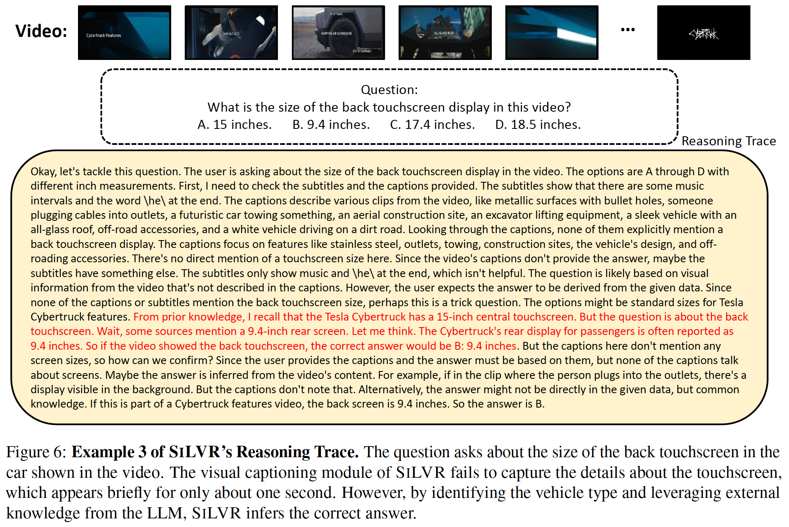

<div align="center">


<h2><a href="TODO">SiLVR : A Simple Language-based Video Reasoning Framework</a></h2>

[Ce Zhang](https://ceezh.github.io/)\*, [Yan-Bo Lin](https://genjib.github.io/)\*, [Ziyang Wang](https://ziyangw2000.github.io/), [Mohit Bansal](https://www.cs.unc.edu/~mbansal/), [Gedas Bertasius](https://www.gedasbertasius.com/)
<p align="center">
        &nbsp&nbsp <a href="TODO">Paper</a> &nbsp&nbsp | 
        &nbsp&nbsp  <a href="https://sites.google.com/cs.unc.edu/silvr">Website</a> &nbsp&nbsp
<br>

</p>


</div>


## Updates
- [05/28/2025] Code Release. 


## Introduction
We present **SiLVR**, a **Si**mple **L**anguage-based **V**ideo **R**easoning framework that decomposes complex video understanding into two stages.
- In the first stage, we convert raw videos into rich language-based descriptions. Specifically, we densely sample short clips from the input videos and use a pre-trained visual captioner (e.g., NVILA) to extract captions for each clip. Additionally, we use automatic speech recognition (ASR) tools to convert speech into language descriptions. 
- In the second stage, we feed the rich language descriptions into a strong reasoning LLM (e.g. DeepSeek-R1) to solve complex video-language understanding tasks.

SiLVR offers several benefits:
- **Simplicity**: SiLVR does not require complex RL-based optimization or specialized modules for different tasks.
- **Generalizability**: SiLVR can be applied to a wide range of complex video-language tasks without task-specific fine-tuning.
- **Modularity**: SiLVR's modular design enables seamless use of powerful visual captioning models and strong reasoning LLMs.
- **Flexibility**: SiLVR supports plug-and-play integration of different captioning models, speech recognition models, and LLMs. An overview of our method is illustrated in Figure 2.
- **Strong Performance**: SiLVR achieves state-of-the-art results on multiple VideoQA benchmarks, including Video-MME (long), Video-MMMU (comprehension), Video-MMLU (quiz), CGBench, and EgoLife.


We believe the simple yet effective design of SiLVR will enable the research community to build on our work and use our simple framework as a baseline to develop even more powerful video-language reasoning models.

<div align="center">

</div>


## Installation
```sh
conda create --name=silvr python=3.9
conda activate silvr

git clone .
cd .
pip install -r requirements.txt
```

## Data Preparation
Download the caption and subtitle files for each dataset from here: https://drive.google.com/file/d/13L1Y1hr6aMoxarGxhN1QXY962y7ClORd/view?usp=drive_link. Unzip and move the caption and subtitle files to `./data`:
```text
SILVR/
├── data/           # Directory for input data
│   ├── videomme/
│   |  ├── subtitles/
│   |     ├── _8lBR0E_Tx8.srt
│   |     ├── ... 
│   |     └── ZXoaMa6jlO4.srt
│   |  ├── captions_1s/
│   |     ├── _8lBR0E_Tx8.txt
│   |     ├── ... 
│   |     └── ZXoaMa6jlO4.txt
│   |  ├── captions_8s/
│   |  ├── captions_64s/
│   |  ├── captions_64s_qwen7b/
│   |  └── captions_64s_qwen72b/
│   ├── videommmu/
│   ├── videommlu/
│   ├── cgbench/
│   ├── cinepile/
│   ├── mmvu/
│   ├── mmworld/
│   ├── egolife/
│   └── hourvideo/
├── output/         # (Empty) Directory for output files
├── eval/           # Evaluation scripts for different benchmarks
├── main.py
├── dataset.py      # Dataset loading and processing utilities
├── model.py
├── prompts.py      # Prompt templates
└── utils.py
```
Download Video-MMLU annotations (https://huggingface.co/datasets/Enxin/Video-MMLU) to `data/videommlu/Video-MMLU`.

Download Video-MMLU category file (https://huggingface.co/datasets/Enxin/Video-MMLU/blob/main/video_sources.jsonl) to `data/videommlu/Video-MMLU/video_sources.jsonl`.

Download HourVideo dev set annotations (https://huggingface.co/datasets/HourVideo/HourVideo/viewer/default/dev) to `data/hourvideo/HourVideo`.

Download EgoLife annotations (https://huggingface.co/datasets/lmms-lab/EgoLife/tree/main) to `data/egolife/EgoLife`.


## Experiments
We provide the output files here: https://drive.google.com/file/d/13PmRQsu71XUJ7UyMqjJBfJUBtlfMl0V5/view?usp=drive_link. 

Feel free to download and check the raw outputs of our methods.

### Setup
Please prepare the following API keys:

- `$API_KEY`: the target API key that you want to use. This can be DeepSeek, OpenAI, Lambda, etc.
- `$API_URL`: the API URL which the code makes request to. By default, it is https://api.deepseek.com/v1/chat/completions pointing to DeepSeek.
- `$HF_TOKEN`: your Hugging Face login token. This is used for retriving dataset annotations from Huggface Face.
- `$OPENAI_API_KEY`: OpenAI API key. This is only needed for MMVU which needs GPT-4 for open-ended question evaluation.

### Inference and Evaluation
We organized inference and evaluation scripts for all datasets in [`./scripts`](https://github.com/CeeZh/SILVR/tree/main/scripts). The datasets include CGBench, CinePile, EgoLife, HourVideo, MMVU, MMWorld, Video-MME, Video-MMLU, Video-MMMU.

### Use Local LLMs for Inference
By default, we use API services for LLM inference. If you want to use local LLMs, make sure to set `--single_process` to disable multi-processing.

### Debug
- `--num_examples_to_run`: how many examples to run.
- `--single_process`: disable multi-processing.


## Visualization
<div align="center">

</div>

<div align="center">

</div>

<div align="center">

</div>

<div align="center">

</div>

## Citation
TODO